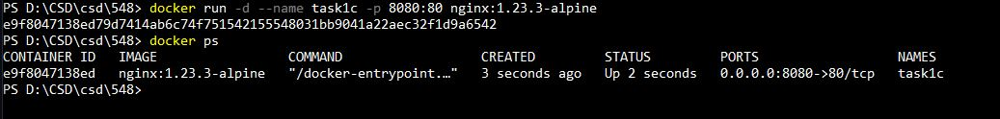

# CS_548-Assignment1
## Csd4054

---

### Task 1
  * a)

		docker pull nginx:1.23.3

		docker pull nginx:1.23.3-alpine

		docker images
			
	
		
  * b)

		Από το screenshot φαίνεται το 1.23.3-alpine είναι 40.7MB και το 1.23.3 είναι 142MB
			
  * c)
		
		docker run -d --name task1c -p 8080:80 nginx:1.23.3-alpine
		
		
	
		
		Μας απαντά μια default σελίδα του nginx όπου μας επιβεβαιώνει ότι ο web server τρέχει επιτυχώς
		
	
	
  * d)

		Από την εντολή docker ps παραπάνω μπορούμε να δούμε ότι το container τρέχει καθώς στο status λέει up 2 seconds.
		
  * e)
			
		docker logs [container_id or name]
		docker logs task1c		
			
	
	
  * f)
		
		docker stop [container_id or name]
		docker stop task1c
		
		Όπως βλέπουμε το container status είναι exited 7 seconds ago άρα σταμάτησε
		
	
	
  * g)

		docker start [container_id or name]
		docker start task1c
		
		Όπως βλέπουμε το container status είναι up 2 seconds άρα τρέχει
		
	
	
  * h)

		docker rm -f task1c
		
		Όπως βλέπουμε το container σταμάτησε και διαγράφτηκε από το σύστημα
		
	
	

### Task 2
  * a)

		Αρχικά τρέχουμε το container:
		docker run -d --name task2 -p 8080:80 nginx:1.23.3-alpine
		
		Μετά ξεκινάμε ένα interactive session με το container και τρέχουμε το sh:
		docker exec -it task2 sh
	
		Κάνω cd /usr/share/nginx/html και εκεί κάνω vi index.html για την επεξεργασία του κειμένου
		
	
	
		
		Όπως βλέπουμε στο επόμενο screenshot ο Τίτλος όντως άλλαξε στο "Welcome to MY nginx!"
		
	
	
  * b)

		Για να μεταφέρουμε το index.html από το container στον τοπικό υπολογιστή το κάνουμε με την εντολή:
		docker cp task2://usr//share//nginx//html//index.html Documents//local-html//index.html
		
		Έπειτα του έκανα την αλλαγή ώστε ο τίτλος να λέει "Page downloaded locally, changed and uploaded this one in it's place"
		και το ανέβασα πίσω στο container με την εντολή:
		docker cp Documents//local-html//index.html task2://usr//share//nginx//html//index.html
		
	
	
		Όπως βλέπουμε στο επόμενο screenshot ο τίτλος όντως άλλαξε.
	
	
	
  * c)
		
		Διαγράφω το container με την εντολή:
		docker rm -f task2
		
		Έπειτα το ξανατρέχω με την ίδια εντολή με πριν και όπως φαίνεται στο παρακάτω screenshot βλέπουμε πάλι την
		default αρχική σελίδα της nginx επειδή όταν διαγράψαμε το container χάθηκαν οι αλλαγές που είχαμε κάνει
		στο index.html και το νέο που φτιάξαμε ξεκίνησε πάλι στην default κατάσταση του.
		
	
	
### Task 3

  * a)
	
		Άρχικά για να πάρουμε το repository και τα submodules γράφουμε:
		git clone https://github.com/chazapis/hy548
		git submodule init
		git submodule update
		
	

		Έπειτα για την εγκατάσταση του hugo εκτελούμε:
		choco install hugo-extended  (Ο choco είναι ένας windows package manager)

		Μετά την εγκατάσταση του hugo μπορούμε να κάνουμε build με τη εντολή:
		make

	
		
		Εκτελώ το container:
		docker run -d --name local_548_site -p 8080:80 nginx:1.23.3-alpine

	

		Αντιγράφω τα αρχεία που παρήγαγε το make από το local μέσα στο container
		docker cp public/. local_548_site://usr//share//nginx//html//

	

		Όπως μπορούμε να δούμε στα παρακάτω screenshots βλέπουμε ότι έγινε το copy μέσα στο container
		και στο localhost:8080 μπορούμε να δούμε πλέον την σελίδα του μαθήματος

	

	
		
	
	
	
	

		
		
  
